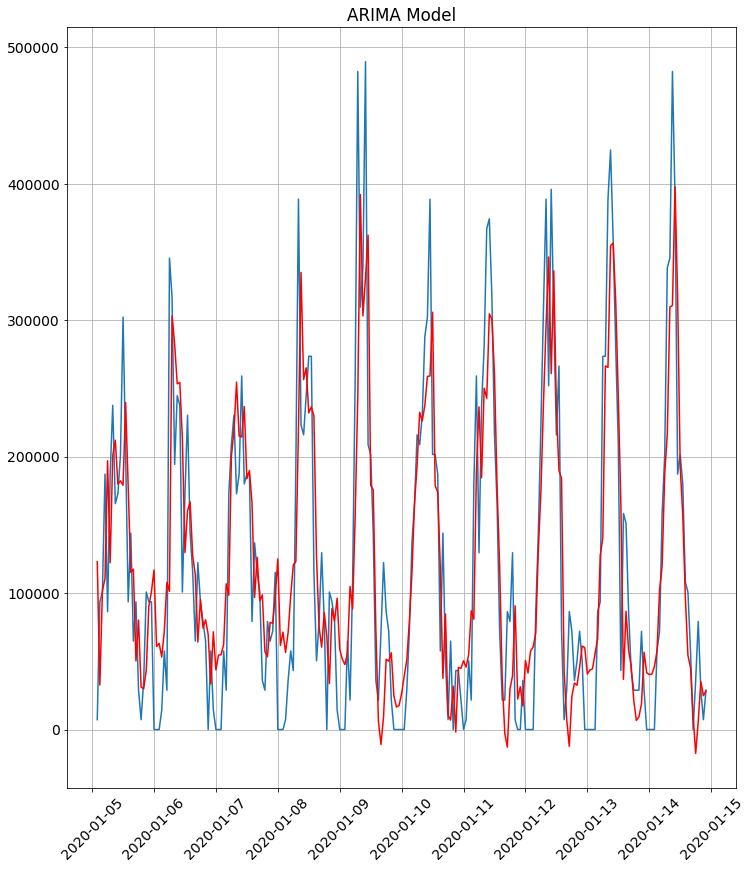
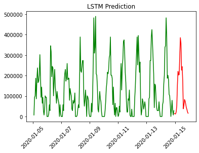

# Infrastructure Based on Charging Power Consumption
This project compares different statistical and deep learning models to predict the future power distribution among Electric Vehicle Chargers. While numerous other models can also be tested, the best Mean Square Average Loss Value of 0.002 is achieved with LSTM Model.

Data Pipeline for prototyping time series algorithms with numerous models

### Data Preprosessing
I could not find a non-stationary charging dataset, so I generated stationary time series dataset from a python script. The dataset is a seasonal dataset with assumption that EV owners will most likely charge their vehicles at 9am (before leaving for work) and 1pm (Break). Using such times as weights and using Gaussian Distributions this stationary dataset was generated.

### Models Used

1) ARIMA Model

2) Neural Net (LSTM)

